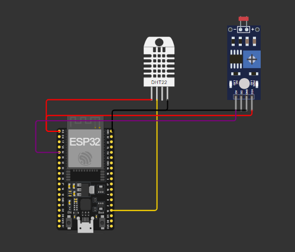

# GS - Edge Computing

## Integrantes 👋
<ul>
    <li>Pedro Henrique Mendes dos Santos (RM555332)</li>
    <li>Gabriel Barros Cisoto (RM556309)</li>  
    <li>Pedro Henrique Bizzo de Santana (RM557263)</li>
</ul>
 

Link da simulação no <a href="https://wokwi.com/projects/410377764841984001">Wokwi</a>

## Explicação do Projeto 📖
Este projeto implementa um sistema de monitoramento de luminosidade e temperatura/umidade usando um microcontrolador com Wi-Fi integrado, um sensor DHT, e comunicação com um broker MQTT.

## Instruções
<ul>
    <li>Faça o upload do código no seu microcontrolador, após configurar os parâmetros de rede Wi-Fi e MQTT.</li>
    <li>Monitore o status da conexão e os dados do sensor via o broker MQTT.</li>
    <li>Envie comandos via MQTT para controlar o LED, usando os tópicos configurados no código.</li>
</ul>

## Componentes 🛠️
<ul>
    <li>ESP32</li>
    <li>DHT11/22</li>
    <li>LDR</li>
    <li>LED</li>
    <li>Potenciomêtros</li>
</ul>
 
 

## Explicando o <a href="https://github.com/fiap-checkpoints-1ESPJ/cp-edge/blob/main/codigo_ESP32.cpp">Código</a> 🧑‍💻

### Dependências 📦
<ul>
    <li>WiFi.h</li>
    <li>PubSubClient.h</li>
    <li>DHT.h</li>
</ul>
 
 
 
Este código é responsável por conectar o dispositivo IoT à rede Wi-Fi e ao Broker MQTT para enviar e receber dados dos sensores e controlar o estado de saída do dispositivo (como o LED onboard).

**Principais Funcionalidades**:
<ul>
    <li>Wi-Fi: Conexão com a rede Wi-Fi utilizando o nome e senha configurados.</li>
    <li>MQTT: Publicação e assinatura em tópicos MQTT para enviar dados de sensores e receber comandos do broker.</li>
    <li>Tópicos utilizados:</li>
        <ul>
            <li>/TEF/device010/attrs: Publica o estado do dispositivo.</li>
            <li>/TEF/device010/attrs/p: Publica o valor da luminosidade (potenciômetro).</li>
            <li>/TEF/device010/attrs/dht: Publica dados do sensor DHT (temperatura e umidade).</li>
            <li>/TEF/device010/cmd: Recebe comandos para controlar o dispositivo (ex: ligar/desligar LED).</li>
        </ul>
    <li>DHT22: Leitura de temperatura e umidade usando o sensor DHT22.</li>
    <li>Luminosidade: Lê valores de luminosidade simulados e os publica no Broker MQTT.</li>
    <li>Callback MQTT: Executa ações com base em mensagens recebidas, como ligar/desligar o LED onboard.</li>
    <li>Gerenciamento de Conexões: Reconecta automaticamente ao Wi-Fi e ao Broker MQTT em caso de desconexão.</li>
</ul>

 

## Estrutura de Tópicos MQTT

| Tópico                        | Descrição                                     |
|-------------------------------|-----------------------------------------------|
| `/TEF/device010/attrs`         | Publicação do estado do LED (ligado/desligado)|
| `/TEF/device010/attrs/p`       | Publicação do valor do potenciômetro          |
| `/TEF/device010/attrs/dht`     | Publicação de temperatura e umidade           |
| `/TEF/device010/cmd`           | Assinatura de comandos para controle do LED   |

 
